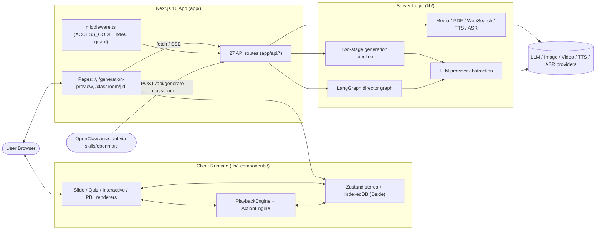
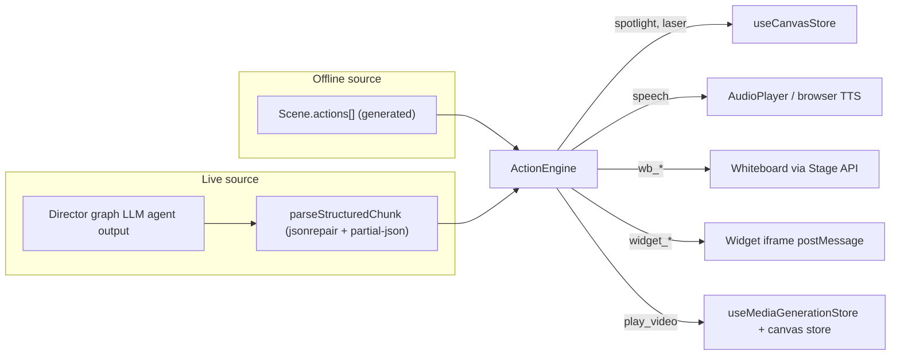
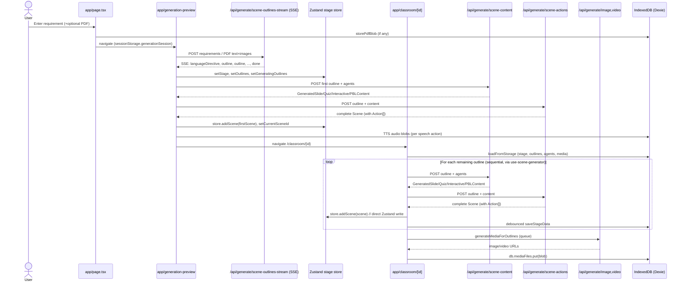
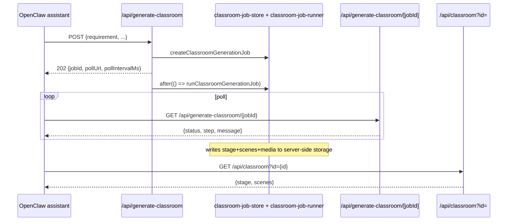
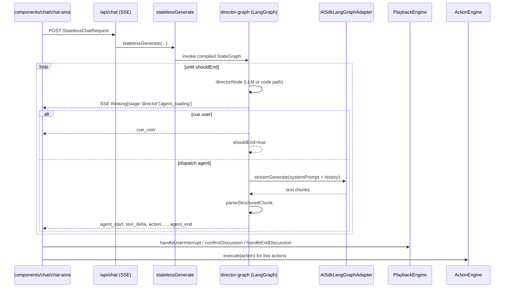
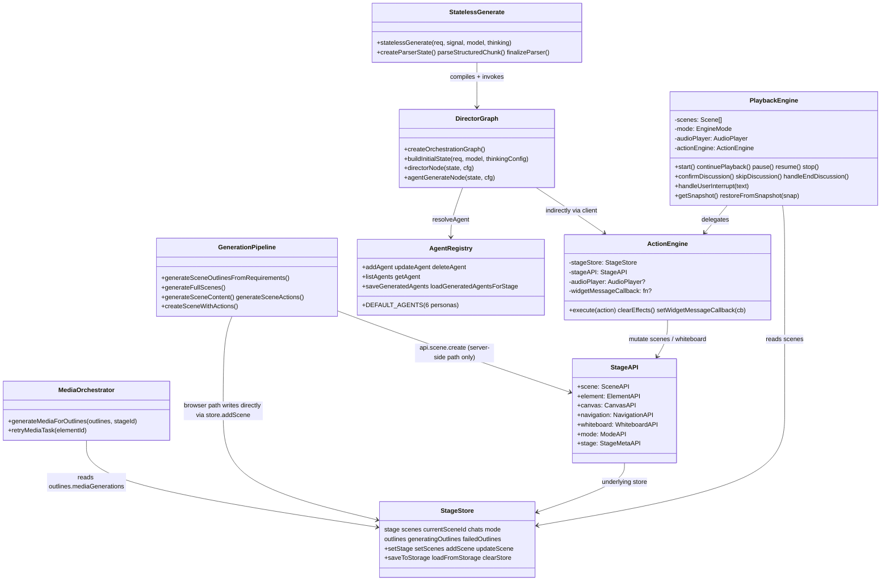
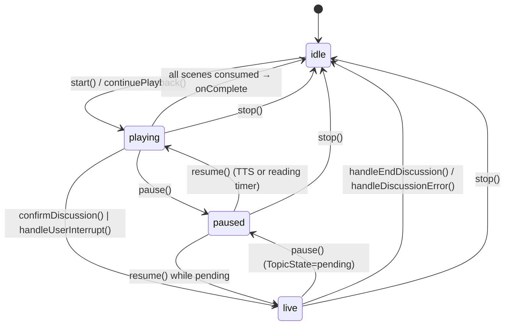
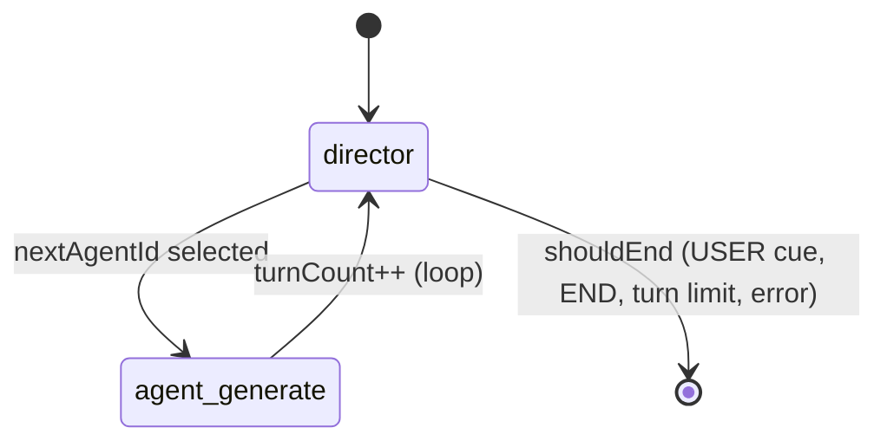
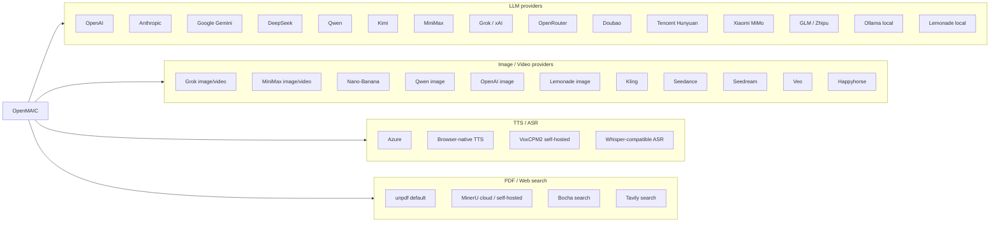

# OpenMAIC — Architecture Overview

This document is a high-level map of the OpenMAIC (Open Multi‑Agent Interactive Classroom) codebase: what each major component is, where it lives, and how it talks to the others. All names below correspond 1:1 to files/folders in the repository.

## 1. System at a Glance

OpenMAIC is a single Next.js 16 app (App Router) with a small server surface and a large client runtime. It converts a free‑form user requirement (+ optional PDF / web search context) into a multi‑scene "classroom" that is then played back by an in‑browser engine and driven by a streaming multi‑agent LangGraph director.

## 2. Repository Layout

```mermaid
flowchart TB
    Root["OpenMAIC/"]
    App["app/ (Next.js routes)"]
    Lib["lib/ (business logic)"]
    Comp["components/ (React UI)"]
    Pkg["packages/ (workspace)"]
    Skills["skills/openmaic (OpenClaw SOP)"]
    Cfg["configs/, public/, assets/"]
    Tests["tests/, e2e/, eval/, scripts/"]
    Build["Dockerfile, docker-compose.yml, vercel.json, next.config.ts, middleware.ts"]

    Root --> App
    Root --> Lib
    Root --> Comp
    Root --> Pkg
    Root --> Skills
    Root --> Cfg
    Root --> Tests
    Root --> Build

    App --> A1["api/* (27 routes)"]
    App --> A2["page.tsx (home)"]
    App --> A3["generation-preview/"]
    App --> A4["classroom/[id]/"]

    Lib --> L1["generation/"]
    Lib --> L2["orchestration/"]
    Lib --> L3["playback/"]
    Lib --> L4["action/"]
    Lib --> L5["ai/ (providers, llm, thinking)"]
    Lib --> L6["api/ (Stage API facade)"]
    Lib --> L7["audio/, media/, pdf/, web-search/"]
    Lib --> L8["export/, import/"]
    Lib --> L9["store/ (zustand), types/, hooks/, prompts/"]
    Lib --> L10["pbl/ (agentic loop)"]
    Lib --> L11["prosemirror/, server/, utils/, storage/, i18n/, contexts/"]

    Comp --> C1["stage.tsx + stage/scene-renderer.tsx"]
    Comp --> C2["slide-renderer/ (Canvas editor)"]
    Comp --> C3["scene-renderers/ (quiz, interactive, pbl)"]
    Comp --> C4["chat/, agent/, roundtable/, whiteboard/"]
    Comp --> C5["generation/, settings/, ai-elements/, ui/"]

    Pkg --> P1["pptxgenjs (vendored fork)"]
    Pkg --> P2["mathml2omml (vendored fork)"]
```

## 3. Major Component Catalog

### 3.1 Next.js entry points (`app/`)
- `app/layout.tsx` — Root layout: `ThemeProvider`, `I18nProvider`, `ServerProvidersInit`, `AccessCodeGuard`, global `Toaster`. Loads Inter + Geist + KaTeX CSS.
- `app/page.tsx` — Home/landing. Requirement textarea, PDF upload, web‑search & Interactive Mode toggles, recent‑classrooms grid (from IndexedDB), settings dialog. Navigates to `/generation-preview`.
- `app/generation-preview/` — Multi‑step generation UI. Drives SSE outline streaming, optional outline review, agent reveal modal, then routes to `/classroom/[id]`.
- `app/classroom/[id]/page.tsx` — Classroom shell loader. Loads stage from IndexedDB (or `GET /api/classroom?id=`), restores agents + media, resumes pending scene generation via `useSceneGenerator`, renders `<Stage>`.
- `middleware.ts` — Edge middleware enforcing `ACCESS_CODE` via an HMAC‑SHA‑256 cookie token (`openmaic_access`). Whitelists `/api/access-code/*` and `/api/health`.
- `next.config.ts` — `output: 'standalone'` (off‑Vercel), transpiles workspace packages, sets `frame-ancestors` CSP.

### 3.2 API routes (`app/api/*/route.ts`)
| Group | Routes | Purpose |
|---|---|---|
| Auth/health | `access-code/status`, `access-code/verify`, `health` | Site password + readiness |
| Generation (per outline) | `generate/scene-outlines-stream`, `generate/scene-content`, `generate/scene-actions`, `generate/agent-profiles`, `generate/image`, `generate/video`, `generate/tts` | Stage‑by‑stage generation API |
| Whole‑classroom job | `generate-classroom/` (POST), `generate-classroom/[jobId]/` (GET), `classroom/`, `classroom-media/[classroomId]/[...path]` | Async server‑side classroom jobs (OpenClaw flow) |
| Live chat | `chat/` | SSE stream of the LangGraph director |
| Tooling | `pbl/chat`, `quiz-grade`, `parse-pdf`, `web-search`, `transcription`, `azure-voices`, `proxy-media`, `server-providers`, `verify-{model,image,pdf,video}-provider` | Misc helpers used by the UI |

### 3.3 Business logic (`lib/`)

- **`lib/ai/`** — `providers.ts` (registry for OpenAI, Anthropic, Google Gemini, DeepSeek, Qwen, Kimi, MiniMax, Grok, OpenRouter, Doubao, Tencent, Xiaomi, GLM, Ollama, Lemonade, OpenAI‑compatible bucket), `llm.ts` (`callLLM`/`streamLLM` wrapping Vercel AI SDK), `thinking-config.ts` / `thinking-context.ts` / `model-metadata.ts`.
- **`lib/generation/`** — Two‑stage pipeline. `outline-generator.ts` (Stage 1 → `SceneOutline[]` + `languageDirective`), `scene-generator.ts` (Stage 2 = Step 3.1 content + Step 3.2 actions, runs in parallel via `Promise.all`), `scene-builder.ts`, `prompt-formatters.ts`, `json-repair.ts`, `action-parser.ts`, `interactive-post-processor.ts`, `pipeline-runner.ts`.
- **`lib/orchestration/`** — Multi‑agent runtime. `director-graph.ts` (LangGraph `StateGraph`), `stateless-generate.ts` (request entry + structured `[{type:"action"|"text",...}]` parser using `jsonrepair` + `partial-json`), `ai-sdk-adapter.ts`, `prompt-builder.ts`, `director-prompt.ts`, `tool-schemas.ts`, `summarizers/{conversation-summary,message-converter}.ts`, `registry/store.ts` (6 built‑in default agents).
- **`lib/playback/`** — `engine.ts` (`PlaybackEngine` state machine: `idle`/`playing`/`paused`/`live`), `types.ts`, `derived-state.ts` (`computePlaybackView`).
- **`lib/action/engine.ts`** — `ActionEngine` executes the unified `Action` union (fire‑and‑forget: `spotlight`, `laser`; synchronous: `speech`, `play_video`, all `wb_*`, all `widget_*`). Auto‑opens the whiteboard for `wb_*` actions; resolves `mediaRef`/generated placeholders against `useMediaGenerationStore`.
- **`lib/api/stage-api.ts`** — Façade composed of `scene`, `element`, `canvas`, `navigation`, `whiteboard`, `mode`, `stage` sub‑APIs. Returns `APIResult<T>`. All scene writes (generation, chat, import) go through here.
- **`lib/pbl/`** — `generate-pbl.ts` uses `ai.generateText` + `stepCountIs` with Vercel AI SDK `tool()` definitions (`set_mode`, `update_title`, `create_agent`, `update_issueboard_agents`, …). Backed by local MCP‑style classes `mcp/{Mode,Project,Agent,Issueboard}MCP` that mutate a shared `PBLProjectConfig`. The MCP‑style naming is conceptual only — no `@modelcontextprotocol/sdk` import is used.
- **`lib/media/`** — `media-orchestrator.ts` (client‑side queue; calls `/api/generate/image|video`; persists Blob to IndexedDB; markPending/markDone/markFailed). 13 provider adapters in `lib/media/adapters/`.
- **`lib/audio/`** — TTS provider registry, ASR registry, VoxCPM voice manager (Auto / Prompt / Clone), browser‑native TTS preview, Azure voice catalog.
- **`lib/pdf/`** — `unpdf` default parser + MinerU (cloud & self‑hosted) variants.
- **`lib/web-search/`** — Bocha + Tavily providers.
- **`lib/export/`** — `use-export-pptx.ts` (HTML/SVG/LaTeX → `pptxgenjs` via `mathml2omml`), `use-export-classroom.ts` (`.classroom.zip` with manifest + media), `html-parser/`, `svg-path-parser.ts`, `latex-to-omml.ts`. Paired with `lib/import/use-import-classroom.ts`.
- **`lib/store/`** — Zustand stores (`stage`, `canvas`, `settings`, `media-generation`, `whiteboard-history`, `widget-iframe`, `snapshot`, `keyboard`, `user-profile`). `stage.ts` debounces IndexedDB writes (500 ms) via `lib/utils/stage-storage`.
- **`lib/types/`** — Centralized types: `stage.ts`, `slides.ts`, `action.ts`, `generation.ts`, `chat.ts`, `provider.ts`, `widgets.ts`, `pdf.ts`, `web-search.ts`, `settings.ts`, `roundtable.ts`, `edit.ts`, `export.ts`.
- **`lib/prompts/`** — Prompt templates + snippets and `buildPrompt(PROMPT_IDS.*, vars)`.
- **`lib/i18n/locales/`** — i18next resources (zh‑CN, en‑US; JA/RU per README).
- **`lib/server/`** — Server‑side helpers: `resolve-model.ts`, `api-response.ts`, `provider-config.ts` (server‑side LLM provider loader; consumed by `app/api/server-providers/route.ts`), `classroom-generation.ts`, `classroom-job-store.ts`, `classroom-job-runner.ts`, `classroom-storage.ts`, `classroom-media-generation.ts`, `proxy-fetch.ts`, `ssrf-guard.ts`, `search-query-builder.ts`, `web-search-config.ts`.

### 3.4 UI components (`components/`)
- `components/stage.tsx` — Classroom shell. Owns a single `PlaybackEngine` + `ActionEngine` + `AudioPlayer`. Wires their callbacks (`onSpeechStart/End`, `onProactiveShow`, `onEffectFire`, `onModeChange`, `onSceneChange`, …) into React state. Hosts `SceneSidebar`, `Header`, `CanvasArea`, `Roundtable`, `ChatArea`.
- `components/stage/scene-renderer.tsx` — Dispatches `Scene` → `SlideEditor`, `QuizView`, `InteractiveRenderer`, or `PBLRenderer`.
- `components/slide-renderer/` — Canvas‑based slide editor & renderer (`Editor/Canvas/`, `components/element/{Chart,Image,Latex,Line,Shape,Table,Text,Video}Element`, `ThumbnailSlide`, `ThumbnailInteractive`).
- `components/scene-renderers/` — `quiz-view`, `quiz-renderer`, `interactive-renderer`, `pbl-renderer`, `classroom-complete`, `pbl/{chat-panel,guide,issueboard-panel,role-selection,use-pbl-chat,workspace}`.
- `components/chat/` — `chat-area` (SSE consumer for `/api/chat`).
- `components/agent/` — Agent bar, avatar, reveal modal, config panel.
- `components/roundtable/` — Participant ring + audio indicator.
- `components/whiteboard/` — SVG whiteboard surface + tools.
- `components/generation/` — Outline editor + generation toolbar + progress.
- `components/settings/` — Settings dialog and sub‑pages (models, TTS, ASR, image, video, PDF parsing, web search, etc. — no MCP panel).
- `components/canvas/`, `components/audio/`, `components/ai-elements/`, `components/ui/` (shadcn + Radix primitives).
- Top‑level: `access-code-guard.tsx`, `access-code-modal.tsx`, `server-providers-init.tsx`, `header.tsx`, `language-switcher.tsx`, `stage.tsx`, `user-profile.tsx`.

### 3.5 Workspace packages (`packages/`)
- `packages/pptxgenjs` — Vendored fork of `pptxgenjs@4.0.1` (MIT); rollup‑built; consumed by export.
- `packages/mathml2omml` — Vendored fork of `mathml2omml@0.5.0` (LGPL); rollup‑built; converts KaTeX/MathML to OMML for PPTX formulas.

Both are built by the root `postinstall` and listed in `next.config.ts → transpilePackages`.

### 3.6 OpenClaw skill (`skills/openmaic/SKILL.md`)
Guided SOP for the OpenClaw assistant: detects optional `~/.openclaw/openclaw.json` config (`accessCode`/`repoDir`/`url`), picks hosted vs self‑hosted mode, walks the user through clone, startup, provider keys, health‑check (`GET /api/health`), then submits a job to `/api/generate-classroom` and polls.

## 4. Cross‑Cutting Concerns

### 4.1 The unified `Action` model
Both the offline `PlaybackEngine` (executing pre‑generated `Scene.actions[]`) and the live `director-graph` (parsing streamed `[{type:"action"...}]` JSON) feed into the same `ActionEngine`. The discriminated union lives in `lib/types/action.ts`.

Action categories (the `Action` union in `lib/types/action.ts` has **21** variants total):
- **Fire‑and‑forget** — `spotlight`, `laser` (auto‑clear after `EFFECT_AUTO_CLEAR_MS` = 5 s).
- **Synchronous (awaitable)** — `speech`, `play_video`, all `wb_*` (`wb_open/close/draw_text/draw_shape/draw_chart/draw_latex/draw_table/draw_line/draw_code/edit_code/clear/delete`), `widget_highlight/setState/annotation/reveal`, `discussion` (lifecycle managed externally).
- **Note**: `TeacherAction` in `lib/types/widgets.ts` is a separate, narrower type produced by widget generation; `convertTeacherActionsToActions` lowers it into the same 21‑variant `Action` union before playback.

### 4.2 LLM thinking adapter
`lib/ai/llm.ts` builds a `MODEL_THINKING_MAP` at module load and translates a unified `ThinkingConfig` (`{mode, enabled, effort?, budget?, level?}`) into provider‑specific options: OpenAI `reasoningEffort`, Anthropic `thinking.{type,budgetTokens}` (with adaptive vs manual budgets), Google `thinkingConfig.{thinkingLevel|thinkingBudget}`. OpenAI‑compatible providers are handled in the fetch wrapper in `providers.ts`.

### 4.3 Auth (`ACCESS_CODE`)
`/api/access-code/verify` issues `${timestamp}.${HMAC_SHA256(timestamp, ACCESS_CODE)}` into cookie `openmaic_access`. Edge middleware validates the HMAC on every request (whitelist: `/api/access-code/*`, `/api/health`). API misses return `401`; page misses fall through to the React `AccessCodeGuard` modal.

### 4.4 Persistence
- **Browser**: Dexie/IndexedDB via `lib/utils/database.ts` (`db.stages`, `db.scenes`, `db.stageOutlines`, `db.mediaFiles`, generated agents, audio files, PDF blobs, images). Zustand stores debounce‑save (500 ms in `stage.ts`). `localStorage` holds user profile, settings, recent‑classroom UI state, web‑search/interactive toggles.
- **Server**: `lib/server/classroom-job-store.ts` + `lib/server/classroom-storage.ts` keep server‑generated classrooms and their media; client falls back to `GET /api/classroom?id=...` when IndexedDB is empty.

## 5. End‑to‑End Flows

### 5.1 Generation flow (interactive UI)

### 5.2 Async server‑side generation (OpenClaw flow)

### 5.3 Live multi‑agent chat / discussion

## 6. Class & Module Relationships

## 7. State Machines

### 7.1 PlaybackEngine modes (`lib/playback/engine.ts`)

### 7.2 Director graph turn loop (`lib/orchestration/director-graph.ts`)

## 8. Data Model Highlights (`lib/types/`)

- **`Stage`** — `{id, name, description?, whiteboard?, videoManifest?, agentIds?, generatedAgentConfigs?, interactiveMode?, languageDirective?, style?, createdAt, updatedAt}`.
- **`Scene`** — `{id, stageId, type: 'slide'|'quiz'|'interactive'|'pbl', title, order, content: SceneContent, actions?, whiteboards?, multiAgent?}`.
- **`SceneContent`** — `SlideContent{canvas:Slide}` | `QuizContent{questions}` | `InteractiveContent{url,html?,widgetType?,widgetConfig?,teacherActions?}` | `PBLContent{projectConfig}`.
- **`SceneOutline`** — Stage‑1 output. `{id, type, title, description, keyPoints[], suggestedImageIds?, mediaGenerations?, quizConfig?, interactiveConfig?(legacy), pblConfig?, widgetType?, widgetOutline?}`.
- **`Action`** — Discriminated union (**21** variants in `action.ts`) with helper sets `FIRE_AND_FORGET_ACTIONS`, `SLIDE_ONLY_ACTIONS`, `SYNC_ACTIONS`. Widget `TeacherAction` (in `lib/types/widgets.ts`) is separate and lowered into this union before playback.
- **`AgentConfig`** — `{id, name, role: 'teacher'|'assistant'|'student'|..., persona, avatar, color, allowedActions[], priority, isDefault?, isGenerated?, voiceConfig?, createdAt, updatedAt}`. Six built‑in defaults (`default-1` … `default-6`).
- **`UserRequirements`** — `{requirement, userNickname?, userBio?, webSearch?, interactiveMode?}`.
- **`StatelessChatRequest`** — `{messages, storeState{stage,scenes,currentSceneId,mode,whiteboardOpen}, config{agentIds,sessionType?,triggerAgentId?,agentConfigs?,discussionTopic?,discussionPrompt?}, directorState?{turnCount,agentResponses,whiteboardLedger}, model?, apiKey?, baseUrl?, providerType?, thinkingConfig?, userProfile?}`.
- **`StatelessEvent`** — SSE event union: `thinking`, `agent_start`, `text_delta`, `action`, `agent_end`, `cue_user`, `error`, `done`.

## 9. Build / Deployment

- **Dev**: `pnpm dev` (Node ≥ 20, pnpm ≥ 10). `postinstall` builds `packages/mathml2omml` and `packages/pptxgenjs`.
- **Prod**: `pnpm build && pnpm start` (Next standalone output unless on Vercel).
- **Vercel**: `vercel.json` present; README has a one‑click deploy URL.
- **Docker**: 4‑stage `Dockerfile` (base → deps with `sharp`/`@napi-rs/canvas` native deps → builder → `node:22-alpine` runner from `.next/standalone`). `docker-compose.yml` exposes 3000 with a named volume mounted at `/app/data` and reads `.env.local`.
- **Tests**: `vitest run` (unit), `vitest.eval.config.ts` (eval), Playwright (`pnpm test:e2e`). Eval runners: `eval/whiteboard-layout/runner.ts`, `eval/outline-language/runner.ts`.
- **Lint/format**: ESLint 9 + Prettier 3 + custom `scripts/check-i18n-keys.mjs`.

## 10. Provider Surface (External Integrations)

## 11. Where Things Live (Quick Reference)

| Concern | File(s) |
|---|---|
| Provider registry | `lib/ai/providers.ts` |
| LLM call wrapper | `lib/ai/llm.ts` |
| Stage‑1 outlines | `lib/generation/outline-generator.ts`, `app/api/generate/scene-outlines-stream/route.ts` |
| Stage‑2 content/actions | `lib/generation/scene-generator.ts`, `app/api/generate/scene-{content,actions}/route.ts` |
| Director graph | `lib/orchestration/director-graph.ts` |
| Stateless generator + parser | `lib/orchestration/stateless-generate.ts` |
| Live chat endpoint | `app/api/chat/route.ts` |
| Playback engine | `lib/playback/engine.ts` |
| Action engine | `lib/action/engine.ts` |
| Stage API façade | `lib/api/stage-api.ts` |
| Zustand stage store | `lib/store/stage.ts` |
| Media orchestrator | `lib/media/media-orchestrator.ts` |
| Classroom shell | `components/stage.tsx`, `components/stage/scene-renderer.tsx` |
| PPTX export | `lib/export/use-export-pptx.ts` |
| Classroom ZIP export/import | `lib/export/use-export-classroom.ts`, `lib/import/use-import-classroom.ts` |
| Access code (HMAC) | `middleware.ts`, `app/api/access-code/*`, `components/access-code-guard.tsx` |
| OpenClaw integration | `skills/openmaic/SKILL.md`, `app/api/generate-classroom/*`, `app/api/classroom/route.ts` |
| Server provider loader | `lib/server/provider-config.ts` (imported by `app/api/server-providers/route.ts`) |
| Web search (outline‑time only) | `lib/web-search/`, `app/api/web-search/route.ts`, `lib/server/web-search-config.ts`, `app/generation-preview/page.tsx` |
| First‑scene synchronous generation | `app/generation-preview/page.tsx` (~lines 802–946) |
| Remaining‑scene continuation | `lib/hooks/use-scene-generator.ts` (calls `store.addScene` directly) |

